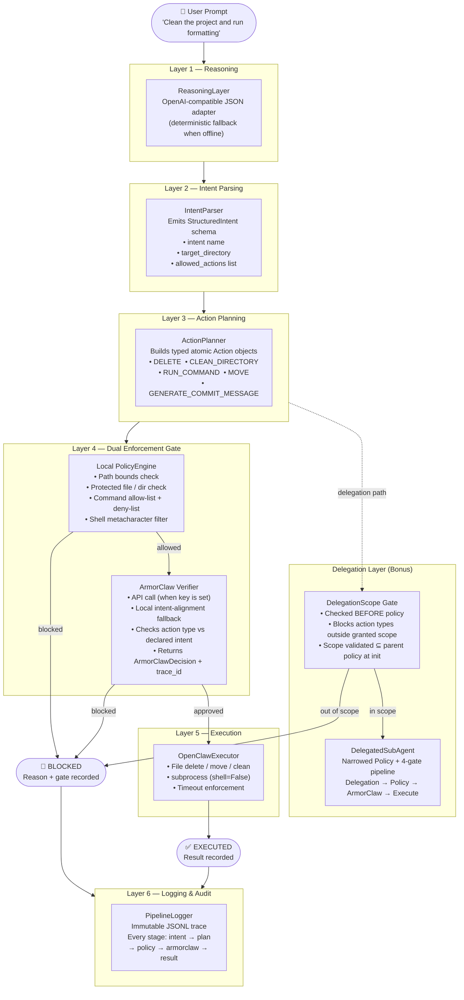

# Clawed — Architecture Diagram

## Full Execution Pipeline



---

## Data Flow: Key Schemas

### StructuredIntent (output of Layer 2)
```json
{
  "intent": "project_cleanup",
  "target_directory": "./demo_project",
  "allowed_actions": ["delete_temp_files", "format_code"],
  "raw_prompt": "Clean the project and run formatting.",
  "reasoning_summary": "User asked to remove temporary artifacts and improve repository hygiene."
}
```

### Action (output of Layer 3)
```json
{
  "type": "delete",
  "path": "./demo_project/tmp",
  "command": null,
  "target": null,
  "source": null,
  "destination": null
}
```

### Policy (ArmorClaw-style enforcement contract)
```json
{
  "project_root": "./demo_project",
  "allowed_directories": ["./demo_project"],
  "protected_files": [".env", "credentials", "secret", "keys"],
  "protected_directories": ["./demo_project/config", "./demo_project/database"],
  "allowed_commands": ["python", "black", "ruff", "isort", "eslint", "git"],
  "blocked_commands": ["sudo", "chmod", "curl", "wget", "powershell", "cmd"],
  "blocked_substrings": ["&&", ";", "|", "`", "$("],
  "max_command_runtime_seconds": 20
}
```

### ArmorClawDecision (output of Layer 4 gate 2)
```json
{
  "approved": true,
  "reason": "Action 'delete' is consistent with intent 'project_cleanup'",
  "verified_by": "local_fallback",
  "trace_id": "1d9a3a6b-c28e-4387-863f-5c7eb4722b2c"
}
```

### DelegationScope
```json
{
  "allowed_action_types": ["run_command"],
  "allowed_commands": ["python", "black", "ruff"],
  "allowed_directories": ["./demo_project"],
  "delegated_by": "SecureDeveloperAgent",
  "reason": "Format-only delegation: sub-agent may invoke formatters, nothing else"
}
```

---

## Enforcement Decision Tree (per action)

```
Action proposed by Planner
│
├─[if DelegatedSubAgent]─► Delegation Gate
│     action.type ∈ granted_action_types?
│     NO  → BLOCKED (gate: delegation)
│     YES → continue
│
├─► Local PolicyEngine
│     path within project_root? → path in allowed_dirs? → not protected? → command in allow-list?
│     ANY FAIL → BLOCKED (gate: local_policy)
│     ALL PASS → continue
│
├─► ArmorClaw Verifier
│     action.type consistent with intent_name?
│     (API call if key set, else local fallback)
│     NO  → BLOCKED (gate: armorclaw)
│     YES → continue
│
└─► OpenClawExecutor  →  EXECUTED (gate: all_passed)
```
